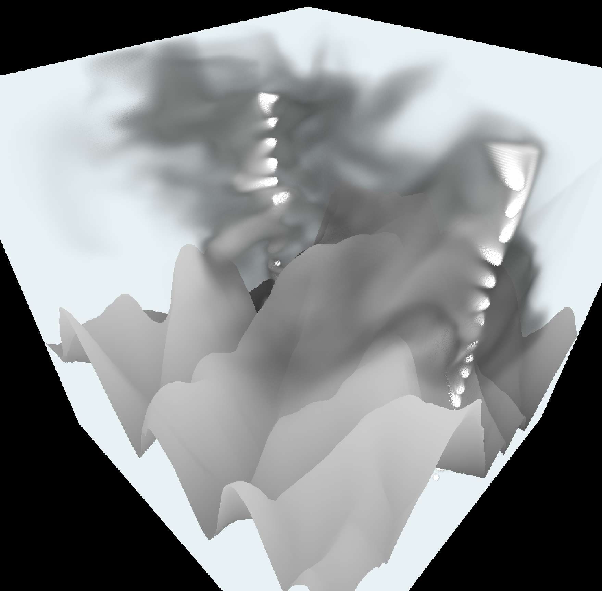

# Terrain_CFD

The aim of Rotor CFD is to aid in the identification of sorces aerodynamic rotor generated by winds flowing over mountains. Rotor poses a majour hazaed for paragliding and can be difficult to identify from the ground. This simulation is capable of rendering smoke trails volumetrically to visualise turbulent air currents.

## Curent Progress

- A stable Eulerian integration scheme has been implemented using the red-black Gauss Seidel method. All simulation steps are performed using Vulkan compute shaders.
- Volumetric rendering has been implimented within a fragment shader for smoke visualisation.
- A rasteriser generates the view of the terrain mesh from real word lidar data.



Smoke trails over the Howgills depicting the air flow resulting from an initial pulse in the +x direction.

### Build instructions

```bash
    mkdir build
    cmake -S . -B build
    cmake --build build
```

### Vulkan Environment

Remember to initialise your enviromnemt variables to point to the Vulkan SDK.